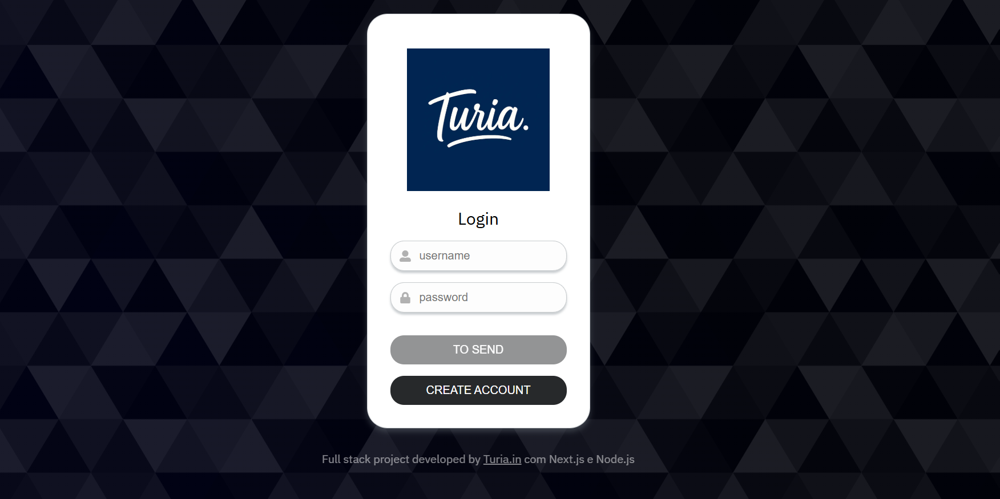
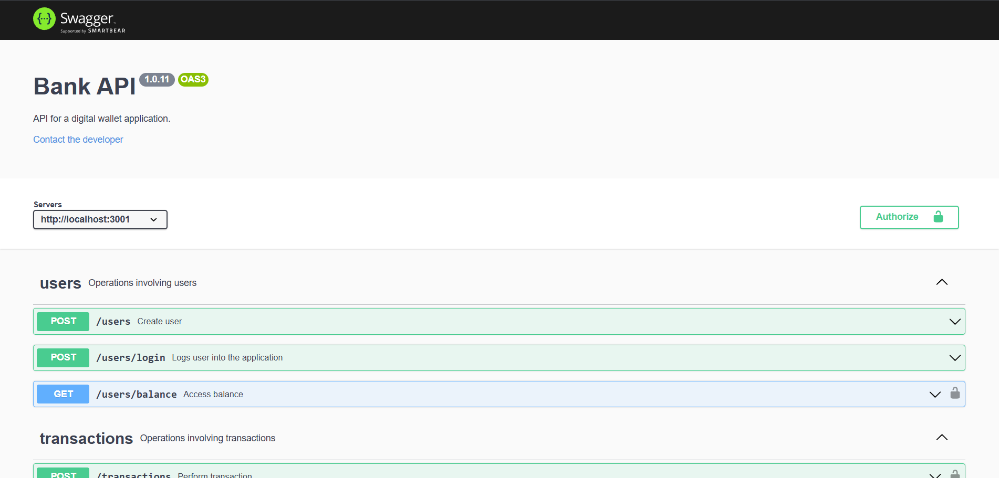
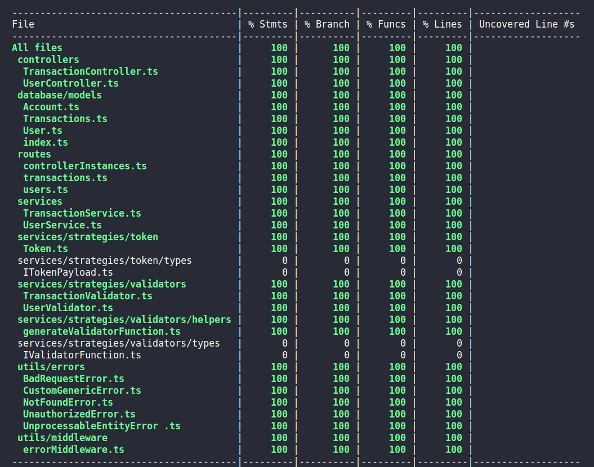
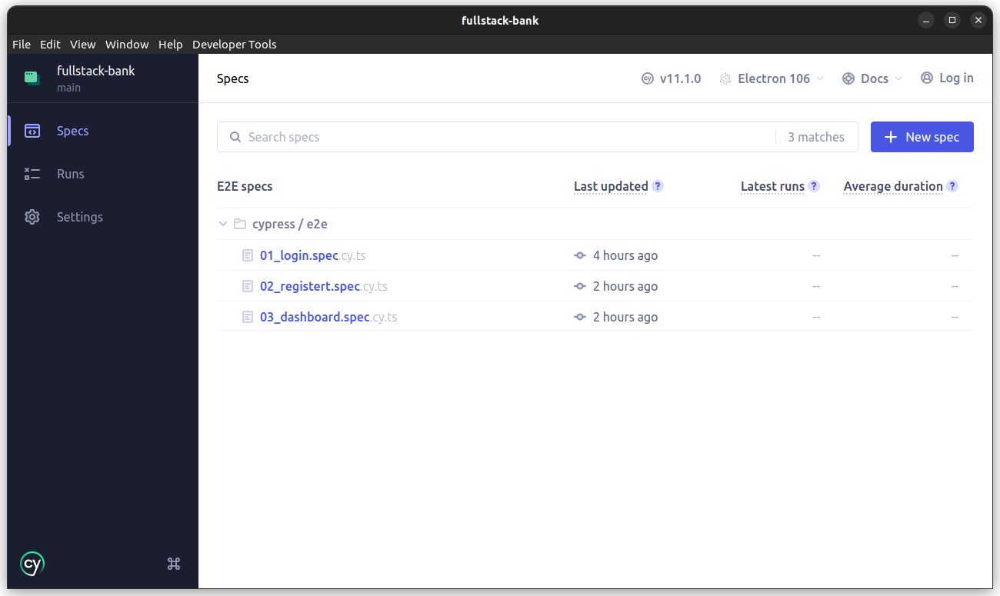

# :coin: Full Stack Bank :dollar:



## :page_with_curl: About

<details>

Full stack digital wallet application developed in Next.js and Node.js with TypeScript and built with Docker.

<br />

## :hammer_and_wrench: Stacks

- TypeScript
- React.js
- Next.js
- Sass
- Cypress
- Testing Library
- Node.js
- Express.js
- Sequelize.js
- PortgreSQL
- Swagger UI
- Mocha.js
- Chai.js
- Sinon.js
- Docker
- Docker Compose

## :hammer_and_wrench: Installation and execution

<details>

To run this application you need to have **Git**, **Docker**, **Node** and **Docker Compose** installed on your computer. Docker Compose needs to be version **2.5.0** or higher and Node version **16**.

In addition, to run the step-by-step commands below, your operating system must also have a **Bash terminal** installed. If you are using **Linux** or **macOS**, Bash is already installed by default. However, if your system is **Windows**, you may need to do [separate installation](https://www.lifewire.com/install-bash-on-windows-10-4101773).

### 1. In the project root directory, run the command below in the terminal to install the dependencies

```sh
npm install
```

### 2. Start the application containers

```sh
npm run compose:up
```

By running the command above, three containers will be started:

- ng_frontend - mapped on the port 3000
- ng_backend - mapped on the port 3001
- ng_db - mapped on the port 3002

They are the front-end, back-end and the database, respectively. After the containers starts, you can enter the <http://localhost:3000> address in your browser to see the application running.

For Loggin in use

Username : kavin
password: admin123

username:xuxameneguel
password:Xuxuxu_xaxaxa_123

To stop the containers, run the command below:

```sh
npm run compose:down
```

<br />
</details>

## :books: API Documentation

<details>

With the application running, access the <http://localhost:3001/docs> address in your browser to see the API documentation implemented with Swagger UI.
<br />

</details>



## :test_tube: Tests

### Integration

<details>

implement backend integration tests with 100% coverage. To check their result, run the command below in the project root directory:

```sh
npm run test: integration
```

**Note:** to run the integration tests, it is not necessary for the application to be running, as the interaction with the database is mocked and the tests start an instance of the API before being started.
<br />

</details>



### E2E (End-to-End)

<details>

implement some E2E tests with the Cypress framework in conjunction with the Testing Library to use semantic selectors. **Applications must be running** before running E2E tests.

To open Cypress in the browser, run the command in the project root directory:

```sh
npm run test:e2e:open
```

A window will open with the list of specs, just click one of them to start the tests.

If you prefer, it is also possible to run the E2E tests without the graphical interface by using the command below:

```sh
npm run test:e2e
```

<br />
</details>



### Run all tests

<details>

Run the command below in the project root directory tp run all integration and E2E tests in sequence in your terminal:

```sh
npm run test
```

**Note:** this command runs the E2E tests without the graphic interface.
<br />

</details>
